<h1 align="center">Stylus-DeepDark</h1>

</h1>

Write thy themes in the dark. May the dark be kinder on thine eyes. (Stylus dark theme)

Also, credit where credit is due for the color palettes down bellow. ([@KDE](https://github.com/KDE), [@horst3180](https://github.com/horst3180), [@linuxmint](https://github.com/linuxmint), [Firefox](https://www.mozilla.org/en-US/firefox/new/), [YouTube](https://www.youtube.com/) and [Discord](https://discordapp.com/))

## Installing

#### Using a browser extension:
* Stylus - get the addon for [Firefox](https://addons.mozilla.org/en-US/firefox/addon/styl-us/), [Chrome](https://chrome.google.com/webstore/detail/stylus/clngdbkpkpeebahjckkjfobafhncgmne) and [Opera](https://addons.opera.com/en-gb/extensions/details/stylus/).
* This is only available using Stylus (see the [documentation](https://github.com/openstyles/stylus/wiki/Usercss)).
* Also see the documentation for information about customizing the theme. :tada:

>**NOTE: This CAN work with Stylish in Google Chrome, BUT I don't support Stylish.**

### **You can also install all my themes at once from [here](https://gitlab.com/RaitaroH/Import-All-Deepdark).**

# Screenshots
Manage page
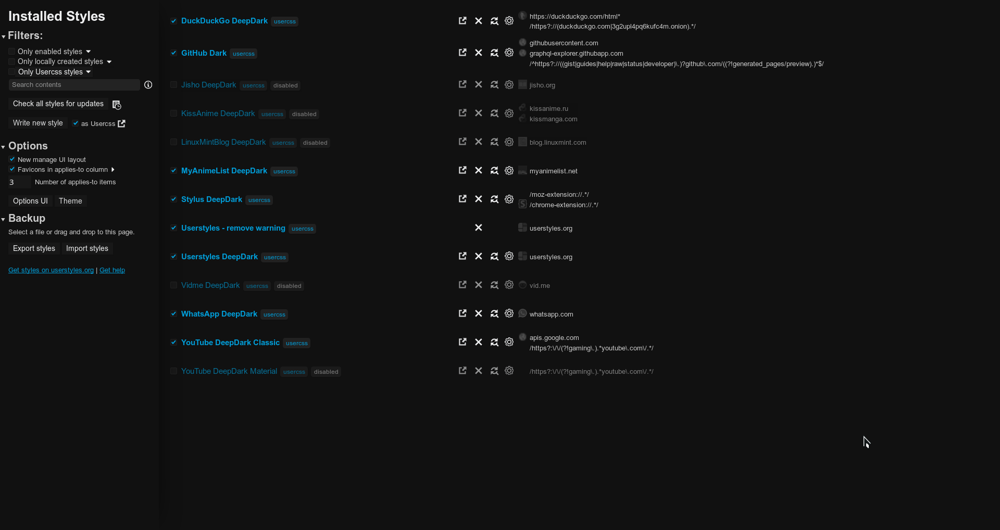
The code and the popup menu themed

A popup window example
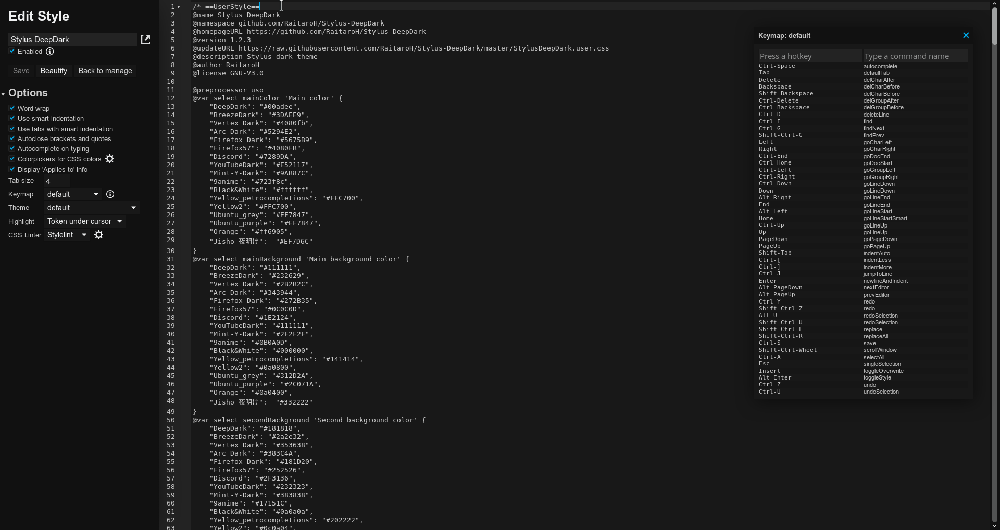

# Colors
Colors Showcase (the colors are available in the code; different colors can be used)
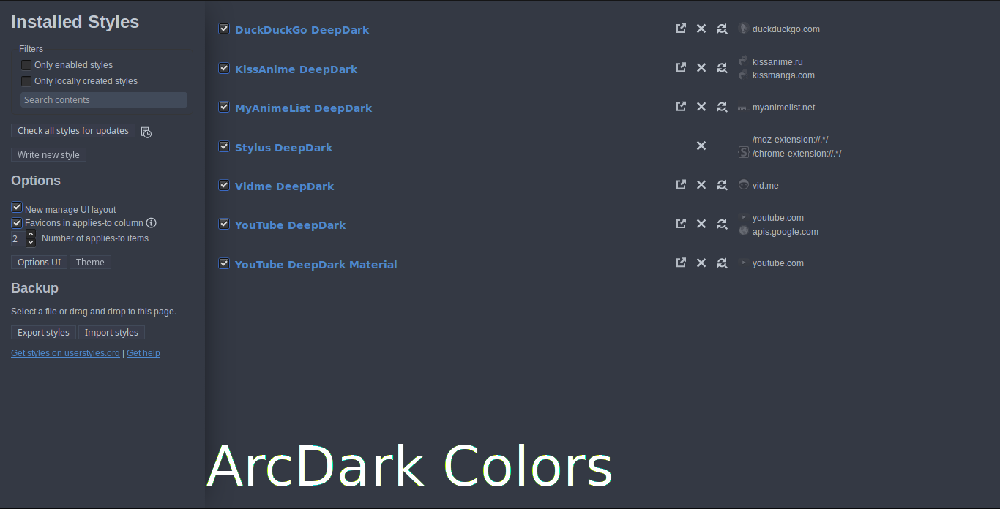
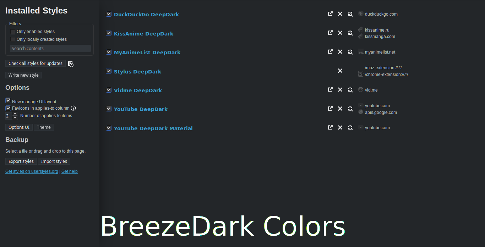
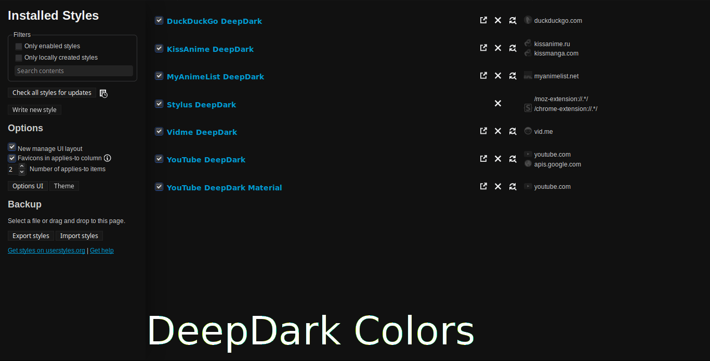
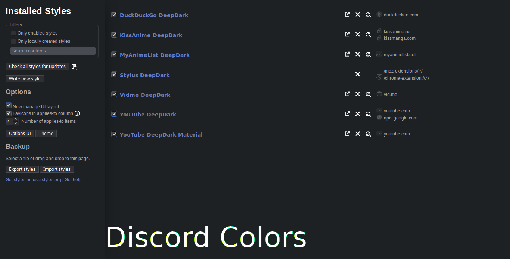
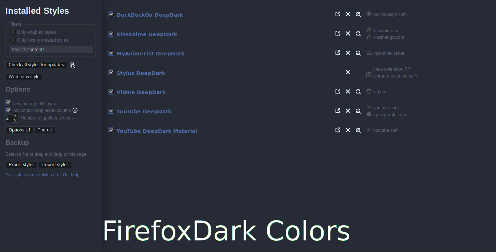
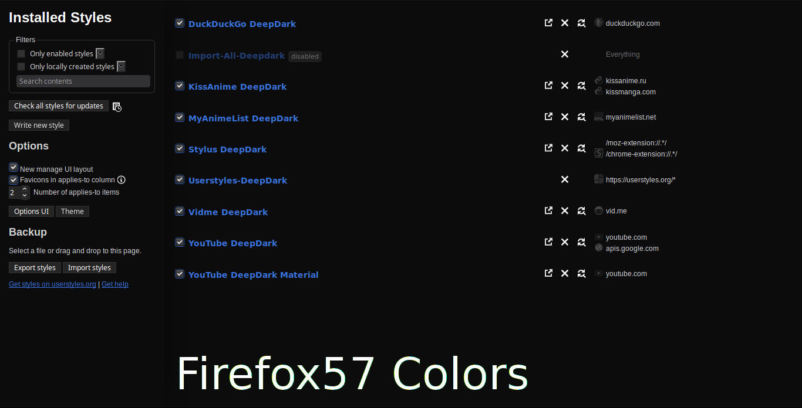
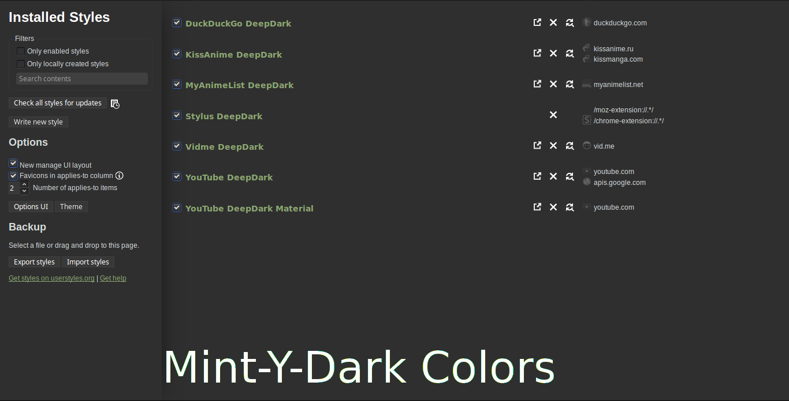
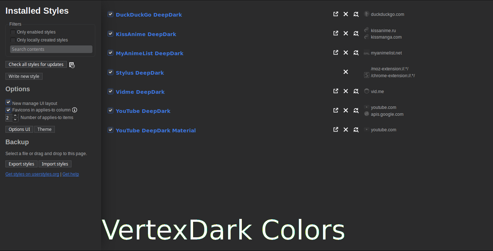
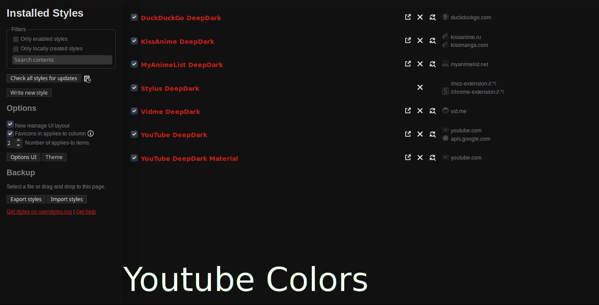
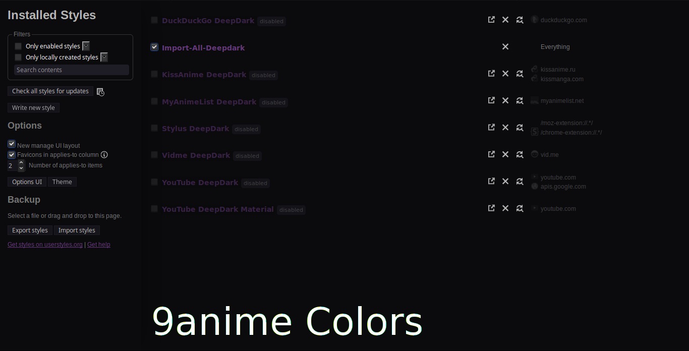

# Code colors
Code colors also change depending on the palette used. No user changes required.
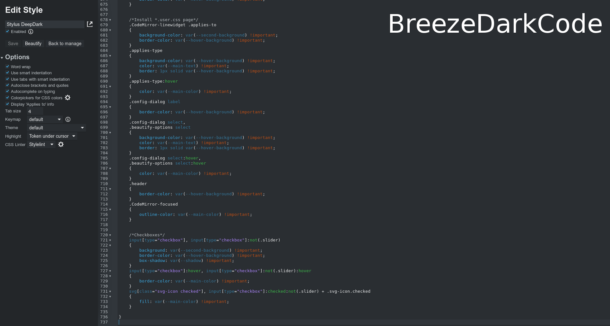

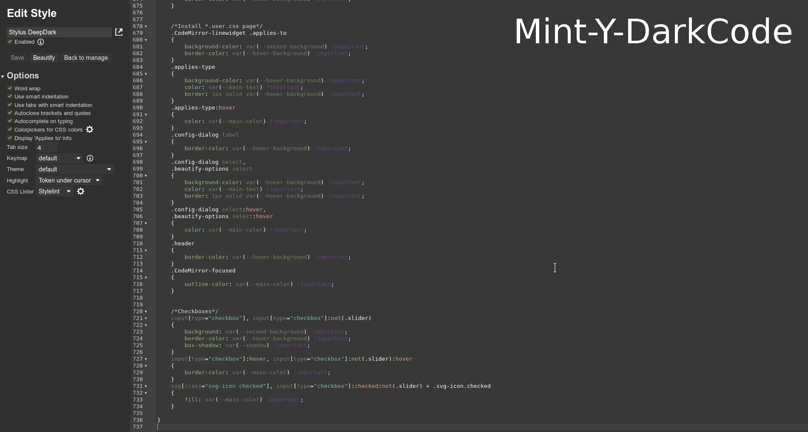

### Development Scripts

Install node.js (if not installed already) and run `npm install` to install dependencies.

* `npm run major`: Creates a semantic major release + tags and signs commit if setup.
* `npm run minor`: Creates a semantic minor release + tags and signs commit if setup.
* `npm run patch`: Creates a semantic patch release + tags and signs commit if setup.

> Note: Releases are created internally, when submitting a PR do not include any. 

* `npm run update`: Update development dependencies.
